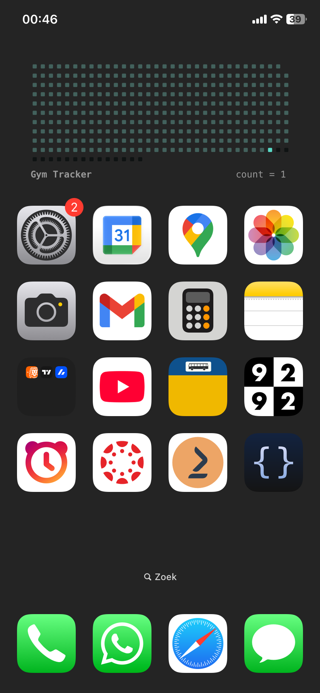

# Scriptable Habit Tracker Widget (iOS)

A tiny, free, privacy-friendly habit tracker that lives directly on your iOS Home Screen.  
Built with **JavaScript in [Scriptable](https://apps.apple.com/app/scriptable/id1405459188)**.

This repo contains a single Scriptable script that draws a **calendar-style grid** of days and lets you track whether you did a habit (like “Gym”) each day. You run the script in Scriptable, answer **✅ / ❌**, and the widget updates:

- Past days: filled / empty squares based on whether you did the habit  
- Future days: dimmed  
- Footer: shows `count = X` — total days you did the habit since your chosen start date  

No logins, no cloud, no analytics. All data is stored in a simple JSON file on your device.

## Example

<p align="center">
  
</p>

## Why This Exists

I wanted:

- A **very simple habit tracker**: just “went / didn’t go”, nothing else.
- Something that lives **on my Home Screen** and gives me an overview of the year.
- A tool that’s **fully free & no subscriptions**.
- Full control over **colors and layout**, so it fits my own aesthetic.

Most habit tracker apps are either overcomplicated or subscription-based. Scriptable lets you build exactly what you want with a bit of JavaScript and run it as a widget.  

This script is my Gym tracker, but you can adapt it to *any* binary habit: reading, meditation, language learning, etc.

## Features

- Calendar-style grid from a configurable `START_DATE` to year-end.
- Each day is a square (`■`):
  - **Completed** → colored square.
  - **Missed** → muted square.
  - **Future** → dark / low-contrast square.
- Footer shows:
  - Left: your `ACTIVITY_NAME` (e.g. `Gym Tracker`).
  - Right: `count = X` — total completed days.

## Requirements

- iPhone or iPad.
- [Scriptable](https://apps.apple.com/app/scriptable/id1405459188) installed from the App Store.


## Setup & Usage

### 1. Install Scriptable

Download Scriptable from the App Store:

> 👉 [Scriptable on the App Store](https://apps.apple.com/app/scriptable/id1405459188)

Open it once so iOS registers it and it can appear in the widget list.


### 2. Create a new script in Scriptable

1. Open **Scriptable**.
2. Tap the **+** button to create a new script.
3. Give it a name, e.g. `Gym Tracker`.
4. Delete any default code.
5. Copy the contents of the script file from this repo (`gym-tracker.js`) and paste it into the editor.
6. Tap **Done** to save.


### 3. Configure the script

At the top of the script you’ll see a configuration section like this:

```js
// Step 1: Set the activity type you're tracking
const ACTIVITY_NAME = "Gym Tracker"; // customize this per Tracker
const STORAGE_FILE = `${ACTIVITY_NAME.toLowerCase()}_activity_progress.json`;

// STEP 2: Set your custom start date
// Format: YYYY, MM-1, DD (Months are 0-indexed, January=0, December=11)
const START_DATE = new Date(2025, 1, 1); // Feb 1, 2025

// Step 3: Configure widget appearance
const BG_COLOR = "#242424";       // Widget background color
const BG_OVERLAY_OPACITY = 1;     // Background opacity (0-1)

// Color settings for dots
const COLOR_FILLED   = new Color("#59dac7"); // Completed days
const COLOR_UNFILLED = new Color("#42615c"); // Missed days
const COLOR_FUTURE   = new Color("#0f1313"); // Future days
````

You can change:

* **`ACTIVITY_NAME`**
  The label shown in the footer and used in the JSON filename.
  Examples:

  * `"Gym Tracker"`
  * `"Reading"`
  * `"Meditation"`
  * `"Language Study"`

* **`START_DATE`**
  The date from which you start tracking this habit.
  Remember: months are **0-based** (January = 0, February = 1, …, December = 11).

* **Colors**
  Tweak the color scheme to your liking:

  * `BG_COLOR` – widget background color.
  * `COLOR_FILLED` – color for days you completed the habit.
  * `COLOR_UNFILLED` – color for days you didn’t.
  * `COLOR_FUTURE` – color for future days.

You can also fine-tune layout:

```js
const PADDING = 12;
const CIRCLE_SIZE = 7.5;     // Square size
const CIRCLE_SPACING = 3;    // Space between squares
const WIDGET_WIDTH = 360;    // Used for layout/alignment
```


### 4. Run the script manually (first-time setup)

Before adding the widget, run the script once from Scriptable to generate the data file and preview the layout:

1. In Scriptable, tap your script (`Gym Tracker`).

2. Tap the **▶︎ Run** button (top right).

3. You’ll see an alert:

   > **Activity: Gym Tracker**
   > Did you complete the task today?
   > ✅ / ❌

4. Tap **✅** if you did the habit today, **❌** if you didn’t.

5. The script writes today’s status to a JSON file and shows a preview of the widget.

Every time you run the script manually, it will ask this same question for *today* and update the data.


### 5. Add the widget to your Home Screen

1. Long-press on your Home Screen until icons start to jiggle.
2. Tap the **+** (top-left) to add a widget.
3. Scroll to / search for **Scriptable**.
4. Choose a **Small** or **Medium** widget.
5. Tap **Add Widget**.
6. Long-press the new Scriptable widget → **Edit Widget**.
7. Set:

   * **Script** → choose your `Gym Tracker` script.
   * Optionally set **When Interacting** → `Run Script`.
8. Tap outside to finish editing.

The widget will now display:

* Your grid of days (filled/unfilled/future), and
* A footer like `count = 8` on the right.


## Credits

The idea for this kind of Scriptable-based habit tracker originally came from  
[@helenmand](https://github.com/helenmand). This project is my own adaptation and extension of that concept.


